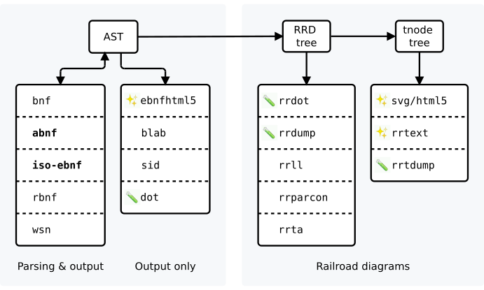

## KGT: Kate's Grammar Tool

Do you want to convert various kinds of BNF to other kinds of BNF? No?  
Well imagine if you did! This would be the tool for you.

 Input:  Various BNF-like syntaxes  
 Output: Various BNF-like syntaxes, AST dumps, and Railroad Syntax Diagrams

Compilation phases:

- Bold indicates the input BNF dialects with the most features
- ✨ indicates presentational formats (these are the good ones!)
- 🧪 indicates debugging formats.  
  You don't want these unless you're looking at kgt's internals.
- Other formats provide various subsets of features

Gallery:

- C89 grammar [WSN source](/examples/c_syntax.wsn)  
  → Presentational BNF:
  [EBNF](https://katef.github.io/kgt/doc/gallery/c89-ebnf.html)  
  → Railroad diagrams:
  [SVG](https://katef.github.io/kgt/doc/gallery/c89-rrd.html),
  [ASCII](https://katef.github.io/kgt/doc/gallery/c89-ascii.txt),
  [UTF8](https://katef.github.io/kgt/doc/gallery/c89-utf8.txt)   ✨ Look at these ones! ✨
- C99 grammar [EBNF source](/examples/c99-grammar.iso-ebnf)  
  → Presentational BNF:
  [EBNF](https://katef.github.io/kgt/doc/gallery/c99-ebnf.html)  
  → Railroad diagrams:
  [SVG](https://katef.github.io/kgt/doc/gallery/c99-rrd.html),
  [ASCII](https://katef.github.io/kgt/doc/gallery/c99-ascii.txt),
  [UTF8](https://katef.github.io/kgt/doc/gallery/c99-utf8.txt)

Getting started:

See the [/examples](examples/) directory for grammars in various
BNF dialects. These have been collated from various sources and
are of various quality. BNF dialects tend to be poorly specified,
and these examples are an attempt to keep a corpus of known-good
examples for each dialect. kgt can't parse them all yet.

kgt reads from _stdin_ in dialect `-l ...` and writes to _stdout_
in format `-e ...`:

    ; kgt -l bnf -e rrutf8 < examples/expr.bnf
    expr:
        │├──╮── term ── "+" ── expr ──╭──┤│
            │                         │
            ╰───────── term ──────────╯
    
    term:
        │├──╮── factor ── "*" ── term ──╭──┤│
            │                           │
            ╰───────── factor ──────────╯
    
    factor:
        │├──╮── "(" ── expr ── ")" ──╭──┤│
            │                        │
            ╰──────── const ─────────╯
    
    const:
        │├── integer ──┤│

and the same grammar output as SVG instead:

    ; kgt -l bnf -e svg < examples/expr.bnf > /tmp/expr.svg

Clone with submodules (contains required .mk files):

    ; git clone --recursive https://github.com/katef/kgt.git

To build and install:

    ; pmake -r install

You can override a few things:

    ; CC=clang PREFIX=$HOME pmake -r install

Building depends on:

 * Any BSD make. This includes OpenBSD, FreeBSD and NetBSD make(1)
   and sjg's portable bmake (also packaged as pmake).

 * A C compiler. Any should do, but GCC and clang are best supported.

 * ar, ld, and a bunch of other stuff you probably already have.

Ideas, comments or bugs: kate@elide.org

